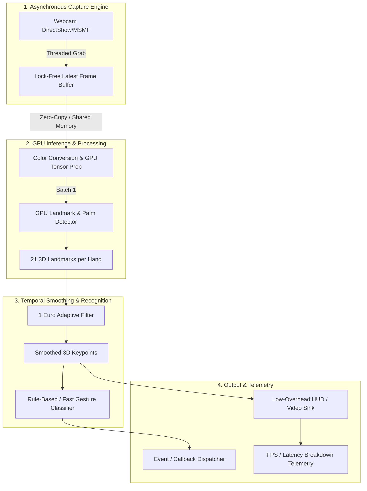

# Project Plan: HandTracking (Real-Time GPU-Accelerated Hand Tracking)

## 1. System Overview & Objectives
**HandTracking** is a high-performance, lightweight, GPU-driven live hand tracking and gesture recognition engine designed for webcam feeds. The primary objective is **near-zero latency** (sub-15ms end-to-end latency, 60+ FPS throughput) with minimal CPU/GPU resource footprints, robust jitter suppression, and real-time landmark estimation.

### Key Performance Targets
- **Throughput**: $\ge 60\text{ FPS}$ on standard 720p/1080p webcams.
- **End-to-End Latency**: $< 15\text{ ms}$ (capture to rendering).
- **Inference Latency**: $3\text{--}8\text{ ms}$ on modern integrated/discrete GPUs.
- **Jitter Suppression**: Zero perceptual lag while eliminating high-frequency landmark jitter.

---

## 2. Target Technology Stack
- **Language**: Python 3.10+ (core architecture designed with C++/Rust bindings/extensions in mind if necessary).
- **Inference Engine**:
  - Primary: MediaPipe / BlazeHand GPU pipeline.
  - Secondary/Alternative: ONNX Runtime (DirectML / TensorRT / CUDA execution providers) for custom neural networks.
- **Video Capture & I/O**:
  - DirectShow / MSMF (Windows) backend via threaded, lock-free ring buffer (dropping stale frames to eliminate buffer buildup).
- **Signal Processing**:
  - Adaptive 1 Euro Filter for real-time 3D landmark smoothing with dynamic cutoff frequency.
- **Testing & Benchmarks**:
  - `pytest`, `pytest-benchmark`, synthetic latency injectors, and headless benchmark harness.

---

## 3. High-Level Architecture

---

## 4. Architectural Subsystems

### Subsystem A: Asynchronous Video Capture Engine (`handtracking.capture`)
- **Stale Frame Elimination**: Traditional OpenCV `cap.read()` introduces a 2-4 frame hardware driver queue. A dedicated background capture thread continuously drains the driver buffer and exposes only the freshest frame via atomic swap / lock-free reference.
- **Configurable Resolutions & FPS**: Auto-negotiate camera capabilities (e.g., 1280x720 @ 60 FPS, NV12/MJPEG/YUY2).

### Subsystem B: GPU Inference Pipeline (`handtracking.inference`)
- **Backend Abstraction**: Pluggable inference interface (`InferenceBackend`) supporting MediaPipe GPU, ONNX Runtime (DirectML / CUDA), and TensorRT.
- **Landmark Topology**: 21 landmark 3D coordinates $(x, y, z)$ per detected hand with confidence score and handedness classification (Left / Right).

### Subsystem C: Signal Smoothing & Jitter Filter (`handtracking.filtering`)
- **1 Euro Filter**: Adaptive low-pass filter dynamically adjusting cutoff frequency based on landmark velocity (smooth at low speeds, responsive at high speeds with zero overshoot).
- **Coordinate Normalization**: Unified screen, camera relative, and world coordinate transforms.

### Subsystem D: Gesture Recognition Engine (`handtracking.gestures`)
- **Geometric Finger State Analyzer**: Real-time state detection (Extended, Flexed, Curled) for Thumb, Index, Middle, Ring, Pinky.
- **Standard Gesture Library**: Pinch / Tap, Fist, Open Palm, Peace / V, Thumbs Up/Down, Point, OK sign.
- **Custom Gesture Definition**: Declarative gesture specification using angular bounds and landmark distance thresholds.

### Subsystem E: Low-Latency Renderer & Telemetry (`handtracking.visualization`)
- **Zero-Copy HUD Overlay**: Efficient landmark skeleton rendering and bounding box drawing.
- **Latency Instrumentation**: Microsecond-precision stage timings (Capture -> Preprocess -> Inference -> Filter -> Gesture -> Render).

---

## 5. Phased Roadmap & Milestones

### Milestone 1: Core Foundation & Async Capture Pipeline [COMPLETED]
- [x] Directory layout & project structure packaging (`pyproject.toml`, `requirements.txt`).
- [x] Implement `AsyncWebcamCapture` with zero-lag background thread and frame drop logic.
- [x] Unit tests for capture pipeline and frame acquisition latency benchmarking.

### Milestone 2: GPU Inference & Landmark Extraction [COMPLETED]
- [x] Implement `HandDetector` interface and GPU-accelerated landmark backend.
- [x] Extract 21 3D landmarks, bounding boxes, and handedness.
- [x] Pipeline verification and accuracy tests.

### Milestone 3: Temporal Smoothing (1 Euro Filter) & Coordinate Systems [COMPLETED]
- [x] Implement 3D `OneEuroFilter` for 21 keypoints.
- [x] Benchmark latency impact vs. jitter reduction ratio.
- [x] Unit tests for filter state resets and tracking continuity.

### Milestone 4: Gesture Classification & Event Dispatcher [COMPLETED]
- [x] Geometric finger pose analyzer (joint angles, distances).
- [x] Standard gesture library + event callback subscription system.
- [x] Gesture recognition unit tests.

### Milestone 5: Low-Overhead Visualization, Telemetry & Demo Application [COMPLETED]
- [x] Real-time HUD renderer with FPS and latency stage metrics.
- [x] Interactive live demo CLI (`python -m handtracking.demo`).
- [x] Full end-to-end integration tests.

---

## 6. Work Order Planning & Tracking
- **WO-001** (Milestone 1): Project scaffolding, packaging (`pyproject.toml`), and `AsyncWebcamCapture`.
  - **Worker**: `codex` | **QA**: `gemma` | **Status**: `COMPLETED` (Commit `9476f51`)
- **WO-002** (Milestone 2): GPU-Accelerated Hand Landmark Inference & Detection Pipeline.
  - **Worker**: `codex` | **QA**: `gemma` | **Status**: `COMPLETED` (Commit `199d58a`)
- **WO-003** (Milestone 3): Temporal Smoothing & Jitter Reduction Engine (Adaptive 3D 1 Euro Filter).
  - **Worker**: `codex` | **QA**: `gemma` | **Status**: `COMPLETED` (Commit `aa1c209`)
- **WO-004** (Milestone 4): Real-Time Geometric Gesture Recognition Engine & Event Dispatcher.
  - **Worker**: `codex` | **QA**: `gemma` | **Status**: `COMPLETED` (Commit `6e58118`)
- **WO-005** (Milestone 5): Low-Overhead HUD Visualization, Telemetry Profiler & Interactive Demo.
  - **Worker**: `codex` | **QA**: `gemma` | **Status**: `COMPLETED` (Commit `4a4a2bc`)
