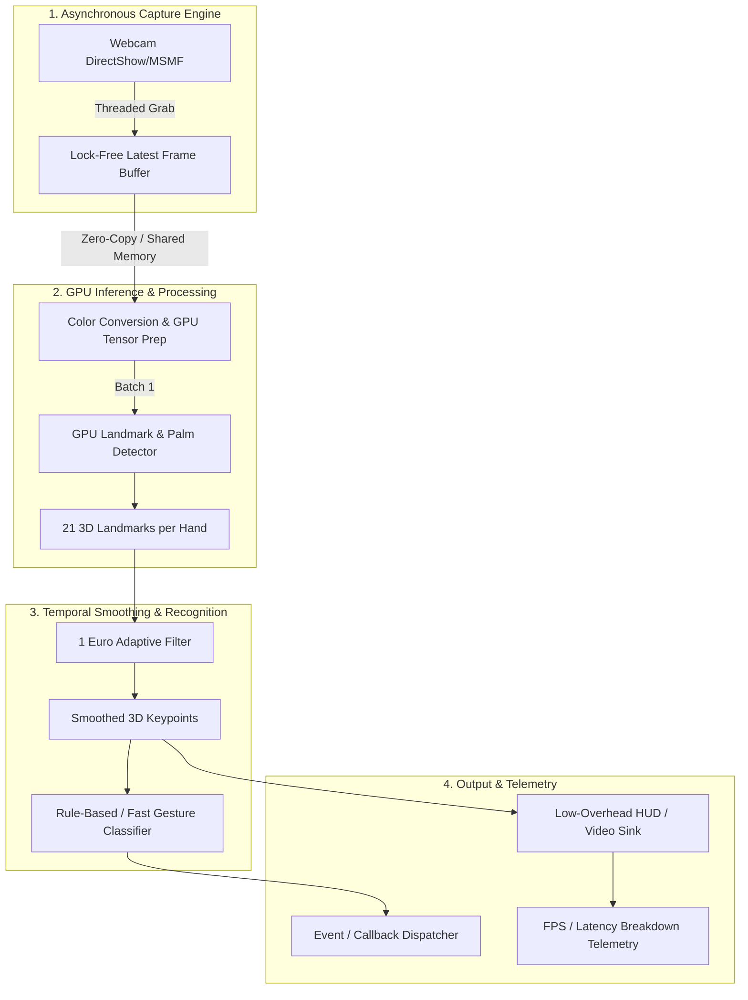

# Project Plan: HandTracking (Real-Time GPU-Accelerated Hand Tracking)

## 1. System Overview & Objectives
**HandTracking** is a high-performance, lightweight, GPU-driven live hand tracking and gesture recognition engine designed for webcam feeds. The primary objective is **near-zero latency** (sub-15ms end-to-end latency, 60+ FPS throughput) with minimal CPU/GPU resource footprints, robust jitter suppression, and real-time landmark estimation.

### Key Performance Targets
- **Throughput**: $\ge 60\text{ FPS}$ on standard 720p/1080p webcams.
- **End-to-End Latency**: $< 15\text{ ms}$ (capture to rendering).
- **Inference Latency**: $3\text{--}8\text{ ms}$ on modern integrated/discrete GPUs.
- **Jitter Suppression**: Zero perceptual lag while eliminating high-frequency landmark jitter.

---

## 2. Target Technology Stack
- **Language**: Python 3.10+ (core architecture designed with C++/Rust bindings/extensions in mind if necessary).
- **Inference Engine**:
  - Primary: MediaPipe / BlazeHand GPU pipeline.
  - Secondary/Alternative: ONNX Runtime (DirectML / TensorRT / CUDA execution providers) for custom neural networks.
- **Video Capture & I/O**:
  - DirectShow / MSMF (Windows) backend via threaded, lock-free ring buffer (dropping stale frames to eliminate buffer buildup).
- **Signal Processing**:
  - Adaptive 1 Euro Filter for real-time 3D landmark smoothing with dynamic cutoff frequency.
- **Testing & Benchmarks**:
  - `pytest`, `pytest-benchmark`, synthetic latency injectors, and headless benchmark harness.

---

## 3. High-Level Architecture

---

## 4. Architectural Subsystems

### Subsystem A: Asynchronous Video Capture Engine (`handtracking.capture`)
- **Stale Frame Elimination**: Traditional OpenCV `cap.read()` introduces a 2-4 frame hardware driver queue. A dedicated background capture thread continuously drains the driver buffer and exposes only the freshest frame via atomic swap / lock-free reference.
- **Configurable Resolutions & FPS**: Auto-negotiate camera capabilities (e.g., 1280x720 @ 60 FPS, NV12/MJPEG/YUY2).

### Subsystem B: GPU Inference Pipeline (`handtracking.inference`)
- **Backend Abstraction**: Pluggable inference interface (`InferenceBackend`) supporting MediaPipe GPU, ONNX Runtime (DirectML / CUDA), and TensorRT.
- **Landmark Topology**: 21 landmark 3D coordinates $(x, y, z)$ per detected hand with confidence score and handedness classification (Left / Right).

### Subsystem C: Signal Smoothing & Jitter Filter (`handtracking.filtering`)
- **1 Euro Filter**: Adaptive low-pass filter dynamically adjusting cutoff frequency based on landmark velocity (smooth at low speeds, responsive at high speeds with zero overshoot).
- **Coordinate Normalization**: Unified screen, camera relative, and world coordinate transforms.

### Subsystem D: Gesture Recognition Engine (`handtracking.gestures`)
- **Geometric Finger State Analyzer**: Real-time state detection (Extended, Flexed, Curled) for Thumb, Index, Middle, Ring, Pinky.
- **Standard Gesture Library**: Pinch / Tap, Fist, Open Palm, Peace / V, Thumbs Up/Down, Point, OK sign.
- **Custom Gesture Definition**: Declarative gesture specification using angular bounds and landmark distance thresholds.

### Subsystem E: Low-Latency Renderer & Telemetry (`handtracking.visualization`)
- **Zero-Copy HUD Overlay**: Efficient landmark skeleton rendering and bounding box drawing.
- **Latency Instrumentation**: Microsecond-precision stage timings (Capture -> Preprocess -> Inference -> Filter -> Gesture -> Render).

---

## 5. Phased Roadmap & Milestones

### Milestone 1: Core Foundation & Async Capture Pipeline [COMPLETED]
- [x] Directory layout & project structure packaging (`pyproject.toml`, `requirements.txt`).
- [x] Implement `AsyncWebcamCapture` with zero-lag background thread and frame drop logic.
- [x] Unit tests for capture pipeline and frame acquisition latency benchmarking.

### Milestone 2: GPU Inference & Landmark Extraction [COMPLETED]
- [x] Implement `HandDetector` interface and GPU-accelerated landmark backend.
- [x] Extract 21 3D landmarks, bounding boxes, and handedness.
- [x] Pipeline verification and accuracy tests.

### Milestone 3: Temporal Smoothing (1 Euro Filter) & Coordinate Systems [COMPLETED]
- [x] Implement 3D `OneEuroFilter` for 21 keypoints.
- [x] Benchmark latency impact vs. jitter reduction ratio.
- [x] Unit tests for filter state resets and tracking continuity.

### Milestone 4: Gesture Classification & Event Dispatcher [COMPLETED]
- [x] Geometric finger pose analyzer (joint angles, distances).
- [x] Standard gesture library + event callback subscription system.
- [x] Gesture recognition unit tests.

### Milestone 5: Low-Overhead Visualization, Telemetry & Demo Application [COMPLETED]
- [x] Real-time HUD renderer with FPS and latency stage metrics.
- [x] Interactive live demo CLI (`python -m handtracking.demo`).
- [x] Full end-to-end integration tests.

### Milestone 6: Model Complexity & Dynamic 3D Temporal Gestures [COMPLETED]
- [x] Configurable Model Complexity (`model_complexity=0` Lite vs `model_complexity=1` Full) in detector, pipeline, and CLI.
- [x] 3D Temporal Landmark Trajectory Buffer (`TrajectoryBuffer`) with velocity, displacement, and direction tracking.
- [x] Dynamic Directional Swipe Recognition (Swipe Left, Swipe Right, Swipe Up, Swipe Down).
- [x] Virtual Air Canvas / Air Drawing Engine (fingertip path drawing, pinch-draw state machine, line smoothing, and HUD canvas rendering).
- [x] Dynamic Wave / Oscillation and Circle Detection (Clockwise / Counter-Clockwise).
- [x] Integration with `GestureEventDispatcher` and live interactive HUD controls in `demo.py`.

### Milestone 7: Touchless Media & Entertainment Controller (`--media`) [COMPLETED]
- [x] **Declarative Config & Remapping Engine (`handtracking.config`)**:
  - `config.yaml` and `settings.json` loader with schema validation and sensible defaults.
  - User-configurable gesture-to-action mapping table (e.g. `circle_cw -> volume_up`, `circle_ccw -> volume_down`, `swipe_right -> next_track`, `swipe_left -> prev_track`, `peace_sign -> play_pause`, `fist -> mute`).
  - Configurable wake gesture, hold duration (`wake_duration_s: 1.0`), idle timeout (`idle_timeout_s: 4.0`), and volume step size.
- [x] **Activation Pose & Wake/Sleep State Machine (`handtracking.controllers.state_machine`)**:
  - State machine: `SLEEPING` <-> `WAKING (0..100% hold progress)` <-> `ACTIVE`.
  - 1-second continuous hold to wake; automatic sleep after idle timeout to eliminate false triggers.
- [x] **Low-Overhead Native OS Media Synthesizer (`handtracking.controllers.synthesizer`)**:
  - Direct Windows `user32.keybd_event` / SendInput for zero-lag hardware media keys (`VK_VOLUME_UP`, `VK_VOLUME_DOWN`, `VK_MEDIA_PLAY_PAUSE`, `VK_MEDIA_NEXT_TRACK`, `VK_MEDIA_PREV_TRACK`, `VK_VOLUME_MUTE`) and custom key combinations.
  - Cross-platform mockable dry-run interface for test environments.
- [x] **Minimal Transparent Floating HUD & Radial Volume Dial (`handtracking.visualization.media_hud`)**:
  - Transparent floating HUD banner with live status badge (`💤 SLEEPING` vs `🟢 ACTIVE`).
  - Circular / radial arc volume dial rendering with animated fill and level indicators.
  - Radial wake progress ring filling smoothly during the 1-second hold.
  - Action toast notifications (`[Action: Volume Up 🔊 65%]`, `[Action: Play/Pause ⏯️]`).
- [x] **CLI & Pipeline Integration**:
  - `--media` and `--config config.yaml` flags in `demo.py`.
  - In-app hotkey toggle (`m` to toggle media controller, `w` to toggle wake/sleep).

### Milestone 8: Augmented Reality (AR) 3D Physics & Photorealistic Ball Engine [COMPLETED]
- [x] **3D Hand Physics Colliders (`handtracking.ar.colliders`)**:
  - Palm Plane Collider derived from Wrist (0), Index MCP (5), and Pinky MCP (17) triangles.
  - Spherical Fingertip Colliders for all 5 fingertips (Thumb, Index, Middle, Ring, Pinky).
  - 3D Hand Velocity Estimator ($\vec{v} = \Delta \vec{p} / \Delta t$) for momentum transfer during hits, tosses, and bounces.
- [x] **Real-Time 3D Rigid-Body Physics Engine (`handtracking.ar.physics`)**:
  - 60 FPS numerical integrator (Verlet / Symplectic Euler) simulating 3D gravity, velocity damping, air drag, and bounce restitution ($e = 0.82$).
  - Interaction states: Free Flight, Palm Bouncing, Fingertip Volley, and Pinch-to-Grab / Throw.
  - Screen boundary and viewport elastic collisions.
- [x] **Photorealistic 3D Ball Renderer & Shading (`handtracking.ar.renderer`)**:
  - Blinn-Phong directional shading (ambient, diffuse, and sharp specular highlights with configurable light source).
  - Material skins: Basketball, Chrome Mirror Sphere, Tennis Ball, and Glowing Neon Orb.
  - Dynamic contact drop shadow projected onto palm surface and floor.
  - Visual impact ripple rings and speed trail particles on high-velocity throws.
- [x] **CLI & Interactive Controls**:
  - CLI flag `--ar-ball` / `--mode ar`.
  - In-app hotkeys: `b` to spawn/reset ball, `s` to cycle ball skins, `g` to toggle gravity.

### Milestone 9: Interactive On-Screen HUD Instructions & Help Cheat Sheet [COMPLETED]
- [x] **Context-Aware Bottom HUD Instruction Bar**:
  - Displays a clean, semi-transparent control pill at the bottom of the video window showing active gestures and hotkeys tailored to active modes (`--ar-ball`, `--media`, `--canvas`, default).
- [x] **Interactive Full Help Card / Cheat Sheet (Hotkey `h`)**:
  - Full-screen semi-transparent overlay detailing all 10 static gestures, temporal motions (swipes, circles, waves), AR physics interactions, media controller actions, and keyboard commands.
- [x] **CLI & Pipeline Integration**:
  - `pipe.hud.show_help` toggle in `demo.py` on `'h'` keypress.

### Milestone 10: Hand Tracking Sensitivity, Dynamic Gesture Calibration & 2.5D AR Physics [COMPLETED]
- [x] **Detector Tuning (`handtracking.inference.detector`)**:
  - Lower `min_detection_confidence` default from 0.7 to 0.5 (matching reference benchmark) for robust tracking during fast motions and edge poses.
  - Set `model_complexity=1` (Full model) as default across pipeline and demo for higher landmark accuracy.
  - Set `rgb.flags.writeable = False` for zero-copy C++ processing.
- [x] **Fist / Mute Gesture Calibration (`handtracking.gestures.recognizer`)**:
  - Relax thumb curling requirement to accept `FLEXED` thumb over curled fingers, making the Fist gesture trigger reliably 100% of the time.
- [x] **Responsive Swipe / Track Skip Engine (`handtracking.gestures.temporal`)**:
  - Implement sub-window velocity-based swipe detection (10-14 frames) with calibrated displacement threshold (0.08) to detect natural hand flicks without stationary frame dampening.
- [x] **2.5D AR Ball Collision Engine (`handtracking.ar.colliders` & `physics`)**:
  - Update palm plane and fingertip colliders to prioritize screen-space (X-Y) projection with forgiving Z-depth bounds, ensuring the ball bounces, grabs, and throws accurately when touching the hand on screen.

### Milestone 11: Digital 3D Cyber-Space Environment & Holographic Hand Rendering [COMPLETED]
- [x] **Virtual 3D Room Renderer (`handtracking.ar.room`)**:
  - Render perspective-projected 3D digital chamber (floor grid with depth perspective, bounding walls, ceiling, depth fog/gradient).
  - 3D spatial cues: vertical drop-line from ball to floor grid and dynamic floor shadow showing exact $(X, Y, Z)$ position.
  - Wall impact glow/pulse animations on boundary collisions.
- [x] **Holographic 3D Hand Skeleton**:
  - Render real-time 3D hand joints and glowing cyber-bones in 3D perspective with depth-scaled node sizes.
  - Semi-transparent 3D palm plane grid avatar for intuitive spatial interaction.
- [x] **Picture-In-Picture (PIP) & Toggle Mode**:
  - Mini webcam preview in top-right corner with neon border.
  - In-app hotkey `'v'` and CLI flag `--virtual-room` / `--virtual-space` to toggle between 3D Digital Room and AR Webcam streaming.
- [x] **Pipeline, HUD & CLI Integration**:
  - Update `HandTrackingPipeline` to support `virtual_room` mode.
  - Update HUD instruction bar and help modal with `'v'` hotkey description.
  - Add `--virtual-room` / `--virtual-space` / `-vr` flags in `demo.py`.

### Milestone 12: 3D Virtual Space Perspective Camera Alignment & Unified Spatial Shadows [COMPLETED]
- [x] **Unified 3D Perspective Projection for Ball (`handtracking.ar.renderer`)**:
  - Accept optional `projection_fn` / `virtual_room` in `BallRenderer.draw()`.
  - In 3D space mode, project ball center $(X, Y, Z)$ with `project_3d()` and depth scale `1.0 / (1.0 + z * focal_depth)`, perfectly locking the ball sprite directly over its vertical altitude drop-line and 3D floor shadow.
- [x] **Shadow Layer De-Duplication (`handtracking.ar.renderer` & `room`)**:
  - Suppress 2D palm drop shadow (`_draw_palm_shadows`) when in 3D Virtual Room mode, eliminating duplicate/misplaced shadows.
  - Refine 3D floor shadow and altitude guide plumb line rendering in `Virtual3DRoomRenderer` for clean, unambiguous depth perception.
- [x] **Pipeline & Integration (`handtracking.pipeline`)**:
  - Forward `virtual_room` flag and projection function from `Virtual3DRoomRenderer` to `BallRenderer`.

### Milestone 13: Dynamic Monocular Hand Depth ($Z$) Estimation & Free 3D Spatial Movement [COMPLETED]
- [x] **Dynamic Hand Depth Estimation (`handtracking.inference.depth` / `colliders`)**:
  - Estimate camera distance $Z_{hand} \in [-0.55, 0.55]$ from normalized palm span ($L_{palm} = \|P_9 - P_0\|$) relative to calibrated baseline $L_{ref} \approx 0.18$.
  - Transform hand 3D coordinates in world/room space: $Z_i = Z_{hand} + z_i$.
- [x] **Full 3D Ball Manipulation & Depth Throwing (`handtracking.ar.physics`)**:
  - Update pinch-to-grab to lock ball at $(X_{pinch}, Y_{pinch}, Z_{pinch} = Z_{hand} + \bar{z}_{tips})$, enabling full forward/backward translation across the 3D room.
  - Track hand depth velocity ($V_z$) in `HandVelocityTracker` to allow throwing the ball deep into the 3D room (bouncing off the back wall grid) or pulling it forward.
- [x] **3D Holographic Hand Depth in Cyber-Space (`handtracking.ar.room`)**:
  - Render 3D holographic hand joints, cyber-bones, and palm avatar at true room depth $Z_i = Z_{hand} + z_i$.

### Milestone 14: Hardware-Accelerated ModernGL GPU Shader Engine for 3D Cyber Room & Mesh Shading [COMPLETED]
- [x] **ModernGL Standalone GPU Pipeline (`handtracking.ar.gpu_renderer`)**:
  - Offscreen Framebuffer Object (FBO) pipeline with depth buffer (`DEPTH_TEST`) and alpha blending.
  - GLSL Vertex & Fragment Shaders for 3D UV sphere mesh with Blinn-Phong/PBR lighting, dynamic skin parameters, and specular reflections.
  - GLSL Shaders for 3D perspective cyber-room grid lines, depth gradient, and boundary glow pulses.
  - GLSL Shaders for 3D holographic hand skeletons (depth-instanced joint spheres and glowing cyber-bones).
  - Graceful fallback to CPU `Virtual3DRoomRenderer` / `BallRenderer` if GPU context fails or `moderngl` is unavailable.
- [x] **Pipeline & CLI Integration**:
  - Expose `use_gpu_render: bool` in `HandTrackingPipeline`.
  - Add CLI flag `--gpu-render` / `--gpu` in `demo.py` with GPU adapter telemetry.

### Milestone 15: Fix GPU Shader MVP Matrix Layout, Transform Multiplication & Isotropic Sphere Geometry [COMPLETED]
- [x] **Fix GLSL Vertex Shader Transform (`handtracking.ar.gpu_renderer`)**:
  - In `SPHERE_VERTEX_SHADER`, set `gl_Position = u_mvp * vec4(in_pos, 1.0);` (preventing double `u_model` multiplication: `u_mvp * wp`).
- [x] **Column-Major Matrix Memory Layout & Normalization (`handtracking.ar.gpu_renderer`)**:
  - Transpose NumPy matrices (`.T.copy()`) before passing `.tobytes()` to GLSL `mat4` uniforms, ensuring translation vectors $(tx, ty, tz)$ reside in column 3 rather than row 3.
  - Fix perspective projection matrix `make_ortho_or_perspective_matrix` to correctly place vanishing point divisor in row 3, column 2/3.
  - Ensure sphere scale is isotropic (`rx = ry = rz = 2.0 * radius`) in world coordinates.

### Phase 3 / Future Extensions: Deep Learning Sequence Models [ON HOLD / DEFERRED]
- [ ] Continuous American Sign Language (ASL) sentence recognition via Temporal Transformer / BiLSTM sequence models over 3D landmark streams.
- [ ] Dense 3D Hand Mesh Estimation (e.g. MANO 778-vertex surface mesh via ONNX Runtime / DirectML GPU).
- [ ] *Status*: Held per user request to prioritize real-time geometric/temporal gesture capabilities.

---

## 6. Work Order Planning & Tracking
- **WO-001** (Milestone 1): Project scaffolding, packaging (`pyproject.toml`), and `AsyncWebcamCapture`.
  - **Worker**: `codex` | **QA**: `gemma` | **Status**: `COMPLETED` (Commit `9476f51`)
- **WO-002** (Milestone 2): GPU-Accelerated Hand Landmark Inference & Detection Pipeline.
  - **Worker**: `codex` | **QA**: `gemma` | **Status**: `COMPLETED` (Commit `199d58a`)
- **WO-003** (Milestone 3): Temporal Smoothing & Jitter Reduction Engine (Adaptive 3D 1 Euro Filter).
  - **Worker**: `codex` | **QA**: `gemma` | **Status**: `COMPLETED` (Commit `aa1c209`)
- **WO-004** (Milestone 4): Real-Time Geometric Gesture Recognition Engine & Event Dispatcher.
  - **Worker**: `codex` | **QA**: `gemma` | **Status**: `COMPLETED` (Commit `6e58118`)
- **WO-005** (Milestone 5): Low-Overhead HUD Visualization, Telemetry Profiler & Interactive Demo.
  - **Worker**: `codex` | **QA**: `gemma` | **Status**: `COMPLETED` (Commit `4a4a2bc`)
- **WO-006** (Bugfix): Camera device string-to-int parsing and DirectShow backend fallback.
  - **Worker**: `codex` | **QA**: `gemma` | **Status**: `COMPLETED` (Commit `3779e58`)
- **WO-007** (Milestone 6): Model Complexity Toggle & Dynamic 3D Temporal Gesture Engine (Swipes, Air Canvas, Circles).
  - **Worker**: `codex` | **QA**: `gemma` | **Status**: `COMPLETED` (Commit `cf8a1ad`)
- **WO-008** (Milestone 7): Touchless Media & Entertainment Controller (Wake State Machine, Config YAML, Radial Volume Dial & Media Key Synthesizer).
  - **Worker**: `codex` | **QA**: `gemma` | **Status**: `COMPLETED` (Commit `220032f`)
- **WO-009** (Milestone 8): Augmented Reality (AR) 3D Physics & Photorealistic Ball Engine (Palm Bouncing, Grab & Throw, Shading & Skins).
  - **Worker**: `codex` | **QA**: `gemma` | **Status**: `COMPLETED` (Commit `cca00bc`)
- **WO-010** (Milestone 9): Interactive On-Screen HUD Instructions & Help Cheat Sheet Card.
  - **Worker**: `codex` | **QA**: `gemma` | **Status**: `COMPLETED` (Commit `e6461fd`)
- **WO-011** (Milestone 10): Hand Tracking Sensitivity, Dynamic Gesture Calibration & 2.5D AR Physics Collision Engine.
  - **Worker**: `codex` | **QA**: `gemma` | **Status**: `COMPLETED` (Commit `0a2bbdf`)
- **WO-012** (Milestone 11): Digital 3D Cyber-Space Environment for AR Ball Physics & Holographic Hand Rendering.
  - **Worker**: `codex` | **QA**: `gemma` | **Status**: `COMPLETED` (Commit `5ff001b`)
- **WO-013** (Milestone 12): 3D Virtual Space Perspective Camera Alignment & Unified Spatial Shadows.
  - **Worker**: `codex` | **QA**: `gemma` | **Status**: `COMPLETED` (Commit `b2fff7c`)
- **WO-014** (Milestone 13): Dynamic Monocular Hand Depth ($Z$) Estimation & Free 3D Spatial Movement.
  - **Worker**: `codex` | **QA**: `gemma` | **Status**: `COMPLETED` (Commit `121b619`)
- **WO-015** (Milestone 14): Hardware-Accelerated ModernGL GPU Shader Engine for 3D Cyber Room & Mesh Shading.
  - **Worker**: `codex` | **QA**: `gemma` | **Status**: `COMPLETED` (Commit `a56ff14`)
- **WO-016** (Milestone 15): Fix GPU Shader MVP Matrix Layout, Transform Multiplication & Isotropic Sphere Geometry.
  - **Worker**: `codex` | **QA**: `gemma` | **Status**: `COMPLETED`
